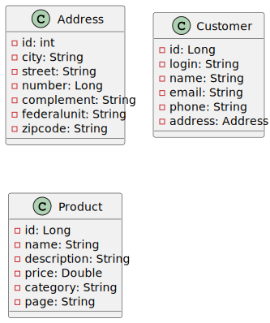
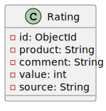
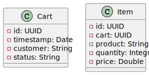
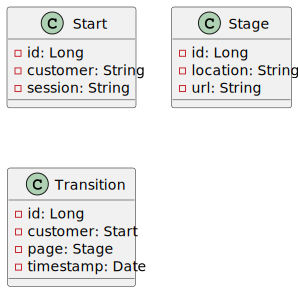

# PolyglotDemoDataGenerator

This project allows you to generate random data for entities stored in PostgreSQL, MongoDB, Cassandra, and Neo4J databases. The goal is to demonstrate how the Esfinge Query Builder framework's polyglot approach works with different kinds of databases.

## Creation of the Environment
The first step is to configure the environment so that each one operates locally. This process can be made easier with [Docker Desktop](https://www.docker.com/). Download Docker Desktop for your operating system and follow the installation steps. To create an instance of each database, run the script below in your terminal. A PostgreSQL database instance will be established, answering on the host's port 5432, a MongoDB instance on port 27017, a Cassandra instance on port 9042, and a Neo4J instance on port 7687.

```` bash
docker pull postgres:12.22
docker pull mongo:8.0
docker pull cassandra:5.0.2
docker pull neo4j:5.25.1-community

docker network create postgres
docker network create mongo
docker network create cassandra
docker network create neo4j

docker volume create postgres_data
docker volume create mongo_data
docker volume create mongo_configdb
docker volume create cassandra_data
docker volume create neo4j_data
docker volume create neo4j_logs
docker volume create neo4j_conf

docker run --rm -d --name postgres -e POSTGRES_PASSWORD=12345678 --hostname postgres --network postgres -p 5432:5432 -v postgres_data:/var/lib/postgresql/data postgres:12.22 -c max_connections=500
docker run --rm -d --name mongo --hostname mongo --network mongo -p 27017:27017 -e MONGO_INITDB_ROOT_USERNAME=mongo -e MONGO_INITDB_ROOT_PASSWORD=12345678 -v mongo_data:/data/db -v mongo_configdb:/data/configdb mongo:8.0
docker run --rm -d --name cassandra --hostname cassandra --network cassandra -p 9042:9042 -v cassandra_data:/var/lib/cassandra cassandra:5.0.2
docker run --rm -d --name neo4j -p 7474:7474 -p 7687:7687 -e NEO4J_AUTH=none --hostname neo4j --network neo4j -v neo4j_data:/data -v neo4j_logs:/logs -v neo4j_conf:/conf neo4j:5.25.1-community
````

## Environment settings
Installing access clients with a graphical interface allows for easy and convenient access to each database. To accomplish this, install the required clients:

- [PgAdmin](https://www.pgadmin.org/download/) for PostgreSQL;
- [MongoDB Compass](https://www.mongodb.com/products/tools/compass) for MongoDB;
- [Datastax Devcenter](https://downloads.datastax.com/#devcenter) for Cassandra (requires Java 8);
- [Neo4J Desktop](https://neo4j.com/download/?utm_source=GSearch&utm_medium=PaidSearch&utm_campaign=Evergreen&utm_content=AMS-Search-SEMBrand-Evergreen-None-SEM-SEM-NonABM&utm_term=download%20neo4j&utm_adgroup=download&gad_source=1&gclid=CjwKCAiA6t-6BhA3EiwAltRFGA6qhfwfYwQJ_jjS57Sfbp7j8lSEkznRH3v5xaCFak8jTF8-XyzRsxoCKT4QAvD_BwE) for Neo4J;

The project is already configured to access each of the installed databases. For PostgreSQL and Cassandra, it is only necessary to create the tables before running the project.

For PostgreSQL, use PGAdmin and create the following tables in the `postgres` database, `public` schema:

```` SQL
CREATE TABLE IF NOT EXISTS public.address
(
    id bigserial,
    city character varying(255) ,
    street character varying(255) ,
    number bigint,
    complement character varying(255) ,
    federalunit character varying(255),
    zipcode character varying(255),
    CONSTRAINT address_pkey PRIMARY KEY (id)
);

CREATE TABLE IF NOT EXISTS public.customer
(
    id bigserial,
    login character varying(255),
    name character varying(255),
    email character varying(255),
    phone character varying(20),
    address_id bigint,
    CONSTRAINT customer_pkey PRIMARY KEY (id),
    CONSTRAINT fk_customer_address FOREIGN KEY (address_id)
        REFERENCES public.address (id) MATCH SIMPLE
        ON UPDATE NO ACTION
        ON DELETE NO ACTION
);

CREATE TABLE IF NOT EXISTS public.product
(
    id bigserial,
    sku character varying(255),
    name character varying(255),
    description text,
    price double precision,
    category character varying(255),
    page character varying(255),
    CONSTRAINT product_pkey PRIMARY KEY (id)
);
````

For Cassandra, use Datastax DevCenter to create a new keyspace with the tables:

```` SQL
CREATE KEYSPACE IF NOT EXISTS store WITH REPLICATION = { 'class' : 'SimpleStrategy', 'replication_factor' : '1' };

CREATE TABLE store.cart (
    id UUID,
    timestamp timestamp,
    customer text,
    status text,
    PRIMARY KEY (id)
) WITH gc_grace_seconds = 864000
  AND bloom_filter_fp_chance = 0.01
  AND caching = {'keys': 'ALL', 'rows_per_partition': 'NONE'}
  AND comment = 'Table for storing shopping cart data'
  AND compaction = {'class': 'org.apache.cassandra.db.compaction.SizeTieredCompactionStrategy'};
  
  CREATE TABLE store.item (
    id UUID,
    cart UUID,
    product text,
    quantity int,
    price double,
    PRIMARY KEY (id)
) WITH gc_grace_seconds = 864000
  AND bloom_filter_fp_chance = 0.01
  AND caching = {'keys': 'ALL', 'rows_per_partition': 'NONE'}
  AND comment = 'Table for storing items in shopping carts'
  AND compaction = {'class': 'org.apache.cassandra.db.compaction.SizeTieredCompactionStrategy'};
````
That is it! With this, you can run the project in your preferred IDE and generate all of the data needed for polyglot testing.

## Data Dictionary

The following table discusses each of the entities mapped in the project. All entities belong to the same application domain, and each database holds domain-related information based on the database's nature. In the created sample, the domain pertains to e-commerce, and the entities embody web store procedures.

| JPA (PostgreSQL) |     MongoDB      |    Cassandra     |       Neo4J      |
|------------------|------------------|------------------|------------------|
|  |  |  | |
Entity `Customer` for stored customers. `Address` for stored customer addresses. `Product` for stored products.| `Rating` entity to record product ratings with values from 1 to 5, with 1 being poor and 5 being excellent. | Entity `Cart` that represents a shopping cart and `Item` to represent the purchased products. | Entities `Start`, `Stage`, and `Transition` represent a graph demonstrating the customer's path while navigating the web store. A `Transition` shows where the customer came from (`Start`) and to which page they went (`Stage`). |

## Data generation

Given that all four database instances are operational and setup, simply execute the `PolyglotDataGeneration` project to generate all of the data. This is accomplished by the test class `DataGeneratorTest`. Uncomment the line `populate();` in the `init()` method before running the `Test File` command. The application will output the following:

```` Plain
25 addresses recorded.
200 carts recorded.
100 customers recorded.
753 items recorded.
50 products recorded.
500 rating recorded.
500 stages recorded.
500 starts recorded.
500 transitions recorded.
````

## Polyglot Tests

We built four projects to test applications within the cited domain. The goal is to demonstrate that Esfinge Query Builder's polyglot functionalities operate with a variety of databases.

### PolyglotDemo1
[PolyglotDemo1](https://github.com/EsfingeFramework/querybuilder/tree/develop/PolyglotDemo/PolyglotDemo1) - `polyglot.demo.DemoTest` - Project that correlates data from `PostgreSQL` and `MongoDB`. In this example, it retrieves product information along with specific ratings.

### PolyglotDemo2
[PolyglotDemo2](https://github.com/EsfingeFramework/querybuilder/tree/develop/PolyglotDemo/PolyglotDemo2) - `polyglot.demo.DemoTest` - Project that correlates data from `Cassandra` and `PostgreSQL`. In this example, it retrieves both shopping cart and customer data.

### PolyglotDemo3
[PolyglotDemo3](https://github.com/EsfingeFramework/querybuilder/tree/develop/PolyglotDemo/PolyglotDemo3)] - `polyglot.demo.DemoTest` - Project that correlates data from `MongoDB` with data from `Cassandra`. In this example, it retrieves information on the shopped items with the highest ratings.

### PolyglotDemo4
[PolyglotDemo4](https://github.com/EsfingeFramework/querybuilder/tree/develop/PolyglotDemo/PolyglotDemo4) - `polyglot.demo.DemoTest` - Project that correlates data from `PostgreSQL` and `Neo4J`. In this example, it retrieves data from customers as they navigate through the shopping site`s pages.
