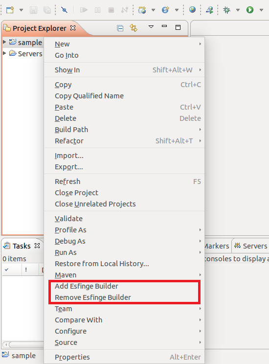
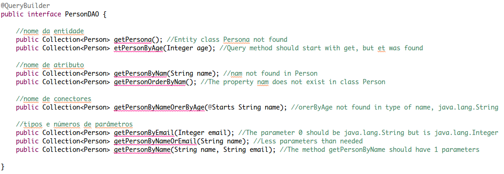
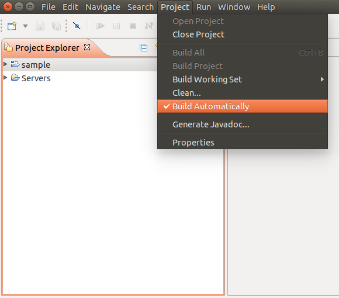
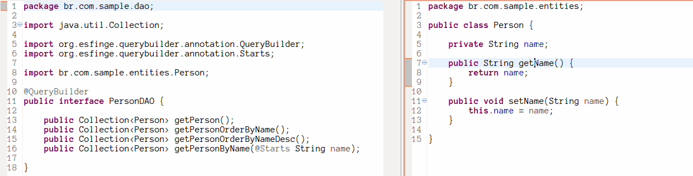
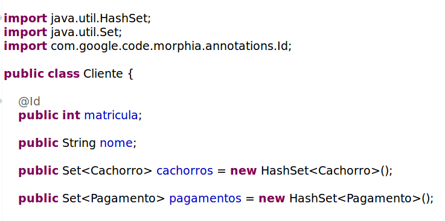
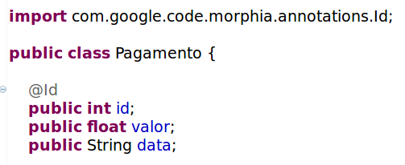
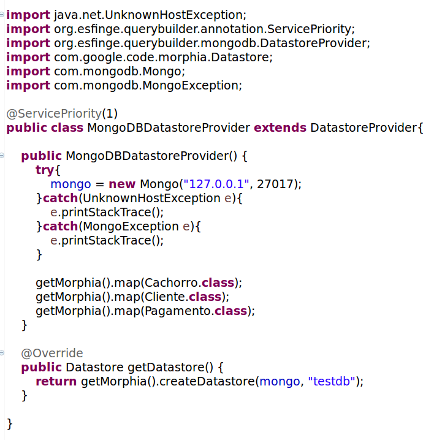
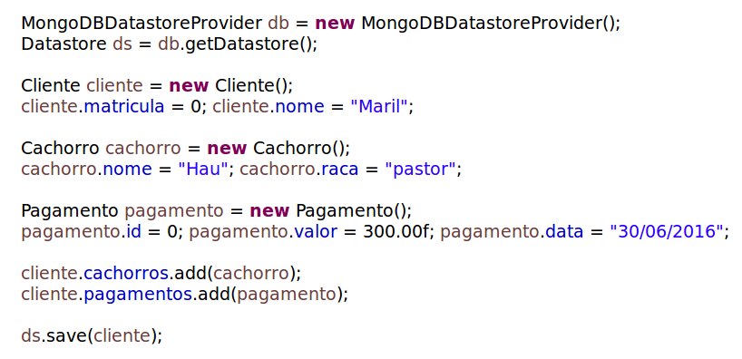
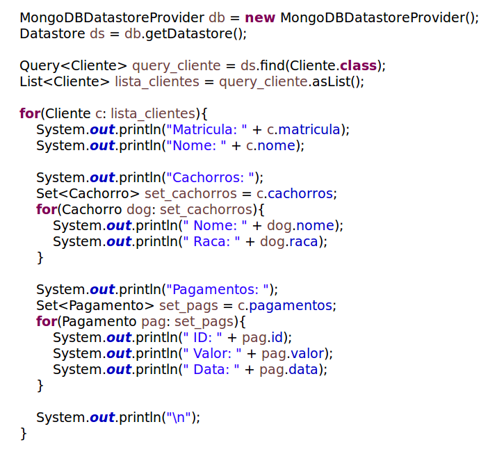

# Esfinge Query Builder

Framework for creating queries based on method names.


# Table of contents
* [Basic functionalities](#query-builder-basic-functionalities)
* [Domain terms](#domain-terms-with-query-builder)
* [Null parameters](#working-with-null-parameters)
* [Custom methods](#custom-methods)
* [Query builder with spring](#integrating-query-builder-with-spring)
* [Eclipse plugin](#eclipse-plugin)
* [Query builder with MongoDB](#query-builder-with-mongodb)

# Query Builder Basic Functionalities

Esfinge Query Builder offers a solution for creating a persistence layer simply and quickly. Using the philosophy "for a good framework, the method name is enough", Query Builder uses the method names of an interface to infer the queries that need to be executed on the database.

## Query Builder in 1 minute

This section gives a quick overview of how the Esfinge Query Builder is used in practice.
The first step is to define an interface with the method names for the queries that need to be made. Optionally, when you want CRUD operations to be available, you can extend the Repository interface. Here is an example of the interface created for the Person class.

```Java
public interface PersonDAO extends Repository<Person>{
    public List<Person> getPersonByLastName(String lastname);
    public List<Person> getPersonByAddressCity(String city);
    public List<Person> getPersonByAgeGreater(Integer age);
}
```

The second step is to create the interface and use it. Is that all? That is it! The idea of the Query Builder is to really make creating the persistence interface very simple. Here is how to create the instance of the class that actually implements this interface:

```Java
PersonDAO dao = QueryBuilder.create(PersonDAO.class);
```

## How does it work?

The method names are interpreted by the Query Builder which generates at runtime a query that is executed in the database and has its result returned. The method getPersonByLastName(), for example, returns instances of the Person class filtering by the lastName property. The method getPersonByAddressCity() does the query filtering by the city property of the address property, which is also a persistent class. Finally, the getPersonByAgeGreater() method will return people older than the age received as a parameter.

Easy enough for you? Learn more about the details and functionality of the QueryBuilder in the following sections.

## Configuring the Query Builder

The Query Builder is designed to be able to work independently of the persistence engine used by the application. For now, only a JPA 1 version is available that works on top of JPAQL query generation. The main classes of the framework are split into 2 JAR files: esfinge_querybuilder_core_1_X.jar and esfinge_querybuilder_jpa1_1_X.jar. The former contains the general framework functionality and the latter the JPA-specific classes. The file esfinge_querybuilder_jpalocal1_1_X.jar should only be included if the JPA entity manager transactions are managed locally. If the transactions are handled by an EJB container through JTA or a framework like Spring, this file should not be included.

In addition you still need other basic JARs for database access, such as the connection driver and the JPA implementation.
Also, a class, which implements the org.Esfinge.querybuilder.jpa1.EntityManagerProvider interface, responsible for returning the EntityManager and EntityManagerFactory instances used by the application, needs to be created. In the case of an application using JPA independent of an application server, this class would look like the example shown below. In the case of using a container, for example, the implementation would retrieve the instances from the JNDI context.

```Java
public class TestEntityManagerProvider implements EntityManagerProvider {
    @Override
    public EntityManager getEntityManager() {
        return getEntityManagerFactory().createEntityManager();
    }

    @Override
    public EntityManagerFactory getEntityManagerFactory() {
        return Persistence.createEntityManagerFactory("database_test");
    }
}
```

To configure this newly created class, you need to create a file named org.esphinge.querybuilder.jpa1.EntityManagerProvider in the META-INF/services directory of any of the application's JAR files. This file must contain only the full name of the class you created.

## Repository

Despite not being one of its main functionalities, the Query Builder implements the basic CRUD functionalities. For this to be used, the interface that you create must implement the org.esfinge.querybuilder.Repository interface. It is important that when implementing this interface you define which persistent class is being used, for example Repository<Person>.

Below are the methods provided by this interface with their descriptions:

| **Method**                    | **Description**                                                                                                                       |
| ----------------------------- | ------------------------------------------------------------------------------------------------------------------------------------- |
| E save(E obj)                 | Writes the object passed as a parameter to the database. The object is inserted if it does not exist or updated if it already exists. |
| void delete(Object id)        | The method deletes from the database the entity whose id was passed as a parameter.database.                                          |
| List<E> list()                | Returns a list of all entities in the database.                                                                                       |
| E getById(Object id)          | Returns an instance according to the id passed as parameter.                                                                          |
| List<E> queryByExample(E obj) | It makes a query that searches according to the populated properties of the object.                                                   |

## Naming the Methods

The names of the interface's methods are used to generate the queries, so it is very important to know how to name them correctly. Below are some rules for the creation of methods:

- The methods must start with get and be followed by the name of the entity. The name used must be the same used by JPA. Example: List<Person> getPerson()
- To pass parameters to the query, the entity name must be followed by by and by property names of the class. The parameter must be of the same type as the property. Example: Person getPersonByName(String name) and Person getPersonByLastName(String name)
- The methods can return an instance of the entity or a list of instances of the entity, like the previous two examples shown.
- The parameter passed can navigate between the dependencies of the class and access properties of them. Example: List<Person> getPersonByAddressCity(String city) , which would filter the city property into the address property.
- To pass more than one parameter you can use and or between properties. The parameters will be considered in the same order as defined in the name. Example: Person getPersonByNameAndLastName(String name, String lastname) and List<Person> getPersonByNameOrLastName(String name, String lastname)

## Other Comparison Types

In addition to the "like" type comparisons used in the examples presented so far, other comparison types are also possible. For other comparison types to be used there are two possible approaches. The first approach is to put annotations on the parameters recording the type of comparison you want to make. See the examples:

```Java
List<Person> getPersonByAge(@Greater Integer age);

List<Person> getPersonByName(@Starts String name);
```

With the annotation-based approach, it is not possible to have two methods that execute a query based on the same parameters but with comparison types. For this reason, syntax where the comparison type is placed right after the property name is also supported. See the examples:

```Java
public List<Person> getPersonByAgeLesser(Integer age);

public List<Person> getPersonByLastNameNotEquals(String name);

public List<Person> getPersonByNameStartsAndAgeGreater(String name, Integer age);
```

The annotations have exactly the same name as the string that needs to be added in the method name. At the moment the supported operators are: Lesser, Greater, LesserOrEquals, GreaterOrEquals, NotEquals, Contains, Starts, Ends.

## Sorting Queries

It is also possible to compose the method names in such a way that the queries are sorted. To do this it is necessary at the end of the method name to put OrderBy followed by the name of the property. If you need to sort by two fields, you can separate their names with and. It is also possible after the name of the property to put Asc or Desc to define the direction of the sorting (ascending or descending), being ASC the default value. See the examples:

```Java
public List<Person> getPersonOrderByName();

public List<Person> getPersonByAgeOrderByNameDesc(@Greater Integer age);

public List<Person> getPersonOrderByNameAndLastName();
```

## Query Objects

When the amount of parameters of a query is too large, it makes it impossible to create a query defined by method name. For these cases, the Esfinge QueryBuilder allows properties of a class to be used as query parameters. This class must be defined as an ordinary Java Bean. The properties must have the same name as the property of the entity that is to be filtered. There are three possibilities to define the comparison types: annotations on the attribute, annotations on the getter method or adding the comparison type at the end of the property name.
Below is an example of such a class. Note that the ageGreater and ageLesser properties exemplify the use of the comparison type in the property name, and the name and lastName properties exemplify the use of annotations on the attribute and getter method respectively.

```Java
public class ExampleQueryObject {

    private Integer ageGreater;
    private Integer ageLesser;

    @Contains
    private String name;
    private String lastName;

    public Integer getAgeGreater() {
        return ageGreater;
    }
    public void setAgeGreater(Integer ageGreater) {
        this.ageGreater = ageGreater;
    }
    public Integer getAgeLesser() {
        return ageLesser;
    }
    public void setAgeLesser(Integer ageLesser) {
        this.ageLesser = ageLesser;
    }
    public String getName() {
        return name;
    }
    public void setName(String name) {
        this.name = name;
    }
    @Contains
    public String getLastName() {
        return lastName;
    }
    public void setLastName(String lastName) {
        this.lastName = lastName;
    }

}
```

After the class has been defined, the interface method should only take this class as a parameter and annotate the parameter with the @QueryObject annotation. Also, the "By" with its parameters should not be used as part of the method name, but the OrderBy and domain terms (shown below) can be used normally.

Below is an example of a method that uses the class defined above:

```Java
public List getPerson(@QueryObject ExampleQueryObject obj);
```

Note that a class that defines a query object can initialize the variables with default values for the query parameters, which is not possible when parameters are used.

# Domain Terms with Query Builder

The Esfinge Query Builder defines a DSL that can be used to define method names so that they are used for query generation. Often there are terms that make sense within the domain that need to be used to compose the method names. This tutorial teaches you how to include domain terms for an interface and use these terms in method names.

## Defining domain terms

Domain terms are defined through annotations on the interface that defines the methods with the queries. Domain terms can be used to define sets of entities that make sense within the business context of the application. These sets are often defined by constraints that are included in the queries. The term overage denotes, for example, people whose age is over 18, and the term paulista denotes people born in the state of São Paulo. The idea is that these terms can be defined and used to compose method names.
When only one domain term is needed, the @DomainTerm annotation can be used to define it. It should set the name of the domain term and the conditions that must be met. The domain term name can consist of more than one word. See below the definition of a domain term with a condition:

```Java
@DomainTerm(term="major", conditions=@Condition(property="age",comparison=ComparisonType.GREATER_OR_EQUALS,value="18"))
public interface PersonQuery{
//methods omitted
}
```

The conditions attribute can receive a list of annotations of type @Condition. Each must define a property (which can access properties of properties, such as address.city), the comparison type, and the value. The comparison type is the only value that can be omitted, defaulting to EQUALS comparison. Below is an example that defines more than one condition:

```Java
@DomainTerm(term="teenager",
conditions={@Condition(property="age",comparison=ComparisonType.GREATER_OR_EQUALS,value="13"),
@Condition(property="age",comparison=ComparisonType.LESSER_OR_EQUALS,value="19")})
public interface PersonQuery{
//methods omitted
}
```

If more than one domain term needs to be defined for the same class, you can use the @DomainTerms annotation, which has a list of domain terms. See below for an example that defines more than one domain term in the same class:

```Java
@DomainTerms({
@DomainTerm(term="elder", conditions=@Condition(property="age",comparison=ComparisonType.GREATER_OR_EQUALS,value="65")),
@DomainTerm(term="paulista", conditions=@Condition(property="address.state",value="SP"))
})
public interface PersonQuery{
//methods omitted
}
```

Using Domain Terms in Methods
Using domain terms in method names is quite easy by including them after the entity name. In this case the condition associated with the domain term will be incorporated into the query. More than one domain term can be used in the same query and they can also be used without restriction along with parameters. See below for a complete example of an interface that uses domain terms in the name of methods:

```Java

@DomainTerms({
@DomainTerm(term="old guys", conditions=@Condition(property="age",comparison=ComparisonType.GREATER_OR_EQUALS,value="65"))
@DomainTerm(term="paulista", conditions=@Condition(property="address.state",value="SP"))
@DomainTerm(term="teenager",conditions={@Condition(property="age",comparison=ComparisonType.GREATER_OR_EQUALS,value="13"),
@Condition(property="age",comparison=ComparisonType.LESSER_OR_EQUALS,value="19")})
})
public interface PersonQueries{
public List<Person> getPersonTeenager();
public List<Person> getPersonPaulista();
public List<Person> getPersonTeenagerPaulista();
public List<Person> getPersonOldGuys();
public List<Person> getPersonPaulistaByAge(@Greater Integer age);
}

```

# Working with NULL Parameters

The normal features of Esfinge QueryBuilder do not allow null parameters to be passed to methods. The result is unexpected depending on the provider used for JPA. With the annotation setting, you can define how a null value should be interpreted by the framework: should the comparison with null actually be done or should the parameter be ignored.

## Comparing with NULL

To perform a comparison with NULL when a null value is passed as parameter, simply include the @CompareToNull annotation. Note that in this case, the comparison that would be made (being greater than, equal to, less than, etc...) will be replaced by the IS NULL clause in the query. Note the use of the annotation in the methods below:

```Java
public List<Person> getPersonByCompany(@CompareToNull String company);

public List<Person> getPersonByNameAndLastName(@Starts String name, @CompareToNull String lastname);

```

In the getPersonByCompany() method, if the NULL parameter is passed, all people who do not have an associated company will be fetched. In the second example, notice that only the second parameter has the annotation, so it will be valid to pass the null value only to it.

## Ignoring NULL parameters

Another interesting option for handling null values is to ignore the parameter when the null value is received. In this case, the parameter will not be included in the query if its value is null. This can be very interesting for creating queries that allow multiple optional parameters. To do this, simply include the @IgnoreWhenNull annotation in the parameter. See the example below:

```Java
public List<Person> getPersonByNameStartsAndLastNameStarts(@IgnoreWhenNull String name, @IgnoreWhenNull String lastname);
```

The example presents a query that searches for the first name and last name beginning with whatever is passed as a parameter. Since both parameters have the @IgnoreWhenNull annotation, both can be ignored. Note that there are actually four possible queries: ignoring no parameters, ignoring the first parameter, ignoring the second parameter, and ignoring both parameters. Using this feature can allow you to combine queries in just one method, eliminating the need to create several others
If the properties are primitive values, to use this feature, it is recommended that you use the respective wrapper classes. For example, use Integer instead of int. This will allow null values to be passed in and this functionality to be used.

## Dealing with NULL in Query Objects

Both the @IgnoreWhenNull and @CompareToNull annotations can be used in class properties when query objects are used for queries. The annotations can be placed on properties or in getter methods.

# Custom Methods

When you create an interface in QueryBuilder, the method invocation is directed to a dynamic proxy that interprets the name and executes the appropriate query. In this way, the interface methods don't actually have an implementation. A separate case occurs when the interface extends the Repository interface, where invocation of the methods of that interface are directed to a specific implementation. This section teaches you how to include methods in the interface that will be passed to a specific implementation.

## Adding a Custom Method

The first step in creating a custom method is to define an interface with just that method:

```Java
public interface CustomMethodInterface {
    public void customMethod()
}
```

Next, you define a class that implements that interface:

```Java
public class CustomMethodImpl implements CustomMethodInterface{
    @Override
    public void customMethod() {
        //does something
    }
}
```

Next you need to configure this implementation as the one that should be used for this interface. This can be done by creating a file with the full name of the interface, in this case org.esfinge.querybuilder.jpa1.custommethods.CustomMethodInterface, in the path META-INF/services inside some jar of the classpath, containing only the name of the implementation, in this case "org.esfinge.querybuilder.jpa1.custommethods.CustomMethodImpl".
After that, any QueryBuilder interface that extends this defined interface will contain its methods and consequently the defined implementation will be executed when they are invoked.

# Parameterizing the interface

As presented in the previous section, the method has a fixed implementation and will normally be added to only one interface. One powerful feature is to allow the implementation to receive the entity class that is being used in the interface. In this way, the implementation can use reflection features to customize the execution depending on the entity.
For this to be possible, the interface that will define the custom method must have a generic type and extend the NeedClassConfiguration interface, as in the example below.

```Java
public interface GenericMethodInterface extends NeedClassConfiguration {
    public E createNewInstance();
}
```

The implementation will need to implement an additional method with the following signature "public void configureClass(Classc)". This method will receive the class to be configured as a parameter of the generic type when implementing the interface. An example implementation is shown below. Note that the implementation uses the class to return a new instance of the class.

```Java
public class GenericMethodImpl implements GenericMethodInterface {

    private Class clazz;

    @Override
    public void configureClass(Class c) {
        clazz = c;
    }

    @Override
    public E createNewInstance() {
        try {
            return clazz.newInstance()
        } catch (Exception e) {
            throw new RuntimeException("Not possible to instantiate "+clazz.getName(),e);
        }
    }

}
```

The configuration of the file that links the interface and configuration is done the same way. When the interface is implemented, you need to specify the generic type that will be used, so that the implementation can receive the class. Here is an example:

```Java
public interface GenericInterface extends GenericMethodInterface{
   //other methods
}
```

Retrieving implementations
The implementations configured in this way can be retrieved via the getServiceImplementation() method of the org.esfinge.querybuilder.utils.ServiceLocator class. This can be very useful in implementations for retrieving services already offered by the framework. Below is an example of how to retrieve the class that provides the EntityManager for the framework.

```Java
EntityManagerProvider emp = ServiceLocator.getServiceImplementation(EntityManagerProvider.class)
```

## Overriding implementations

Any framework implementation that is retrieved in this way can be overridden by another, provided that it has a higher priority. To define a new implementation, the class must implement the desired interface and configure the file that links the implementation to the interface in the way it was presented before. The @ServicePriority annotation must be used in the class passing as parameter a number greater than the priority of the service to be overridden (which is normally zero because this is the default priority when the annotation is not set).
An example is the Repository interface, which is used to implement CRUD type operations. If appropriate, you can override the existing implementation by creating an application-specific one.

# Integrating Query Builder with Spring

Thanks to the contribution of Leonardo Machado Moreira who wrote most of it and developed the example for this tutorial.
Sfinge Query Builder can be easily integrated with other frameworks. This tutorial shows how it can be integrated with Spring Framework, using the EntityManager managed by it.

## Spring Configuration

Below is the file that shows how to configure the beans regarding database access in Spring.

```XML
<?xml version="1.0" encoding="UTF-8"?>
<?xmlns xmlns="http://www.springframework.org/schema/beans"
xmlns:xsi="http://www.w3.org/2001/XMLSchema-instance"
xmlns:tx="http://www.springframework.org/schema/tx"
xsi:schemaLocation="http://www.springframework.org/schema/beans

http://www.springframework.org/schema/beans/spring-beans-3.0.xsd


http://www.springframework.org/schema/tx

http://www.springframework.org/schema/tx/spring-tx-2.5.xsd"
by default-autowire="byName">

<bean id="dataSource">
<property name="driverClass" value="com.mysql.jdbc.Driver"/>

<property name="jdbcUrl" value="jdbc:mysql://localhost:3306/erh"/>
<property name="user" value="root"/>
<owner name="password" value="303016"/>
<owner name="initialPoolSize" value="5"/>
<owner name="minPoolSize" value="5"/>

<property name="maxPoolSize" value="50"/>
<property name="autoCommitOnClose" value="false"/>
<property name="checkoutTimeout" value="30000"/>
<property name="maxStatements" value="50"/>
</bean>

<bean id="entityManagerFactory">
<property name="dataSource" ref="dataSource" />
<property name="persistence-unitname" value="persistence-unit" />
</bean>

<bean id="entityManager">
<property name="entityManagerFactory" ref="entityManagerFactory"/>
</bean>

<bean id="transactionManager">
<property name="entityManagerFactory" ref="entityManagerFactory" />
</bean>

<tx:transaction-manager="transactionManager" />

<bean id="springApplicationContext"/>

</beans>
```

The dataSource bean is responsible for connecting to the database, in this case a MySQL database. The connection setup is simple, except for the connection pool, which in this case was c3p0. This specific connection pool was used because this tutorial has no specific environment, so instead of indicating a pool from any container or web-server the use of c3po proved to be more appropriate.
The entityManagerFactory bean is an implementation of the LocalContainerEntityManagerFactoryBean class, responsible for implementing an Entity Manager factory. The LocalContainerEntityManagerFactoryBean class was chosen because it allows absolute control on the configuration of how the EntityManagers will be created. Pay attention to the persistenceUnitName property, where we enter the name of the persistence unit that the factory should look for. Naturally Spring will look for the persistence.xml file in the resources/META-INF folder.
The bean entityManager in the database.xml file is the most important in Spring's configuration and the Esfinge Query Builder. In Spring and JPA configurations found on the internet this bean is rarely explicitly declared in the context, but Spring always creates this Entity Manager in order to share it throughout the context. If you retrieve an Entity Manager using the @PersistenceContext annotation you will certainly get a SharedEntityManagerBean class. This class is just another implementation of the Entity Manager like any other, with one difference, it is Thread-Safe, because it will be shared by the entire context.
The transactionManager bean was also declared just to indicate the transaction manager to be used.
The springApplicationContext bean was created to facilitate Spring's integration with the Esfinge Query Builder, allowing it to retrieve the EntityManager from Spring's context. Below is the implementation of this class that is used to retrieve the Spring context.

```Java
public class SpringApplicationContext implements ApplicationContextAware {

private static ApplicationContext CONTEXT;

@Override
public void setApplicationContext(ApplicationContext applicationContext) throws BeansException {
CONTEXT = applicationContext;
}

public static Object getBean(String beanName) {
return CONTEXT.getBean(beanName);
}

public static Object getBean(Class<?>classType) {
return CONTEXT.getBean(classType);
}
}
```

## Configuring the Query Builder

At this point all the necessary configuration for Spring has been described, now the configuration of the Esfinge Query Builder will be covered. The file resources/META-INF/services/org.esfinge.querybuilder.jpa1.EntityManagerProvider will be responsible for indicating to the Query Builder the class where an EntityManager implementation will be picked up, in this case the class org.esfinge.example.jpaprovider.JPAEntityManagerProvider shown below:

```Java
public class JPAEntityManagerProvider implements EntityManagerProvider {

@Override
public EntityManager getEntityManager() {
return (EntityManager) SpringApplicationContext.getBean("entityManager");
}

@Override
public EntityManagerFactory getEntityManagerFactory() {
return (EntityManagerFactory) SpringApplicationContext.getBean("entityManagerFactory");
}
}
```

This class contains the methods indicated by the EntityManagerProvider class, from querybuilder, where the return of an EntityManager and an EntityManagerFactory is required. In this application the EntityManager instances and the EntityManagerFactory were retrieved from the Spring context using another class SpringApplicationContext.
This is Spring's own way of retrieving beans present in the Spring context by code from outside the context. This is where the springApplicationContext bean is important, because it will allow the EntityManagerProvider class to retrieve the EntityManager and EntityManagerFactory beans from Spring even without belonging to any kind of context.

Now just create the instances from QueryBuilder based on your interfaces!
Attention: it is important to remember that when Spring's EntityManager is used, the file esfinge_querybuilder_jpalocal1_1_X.jar must not be included in the classpath!

# Eclipse Plugin

The Esfinge Query Builder also offers a plugin for Eclipse that aims to make development even easier by finding errors in the framework's DSL usage and pointing them out to the user at compile time that would otherwise only be found at runtime. The plugin seeks to take full advantage of the Query Builder's validation features, since it makes use of the framework itself to validate the DSL employed in the query methods. In addition, the plugin is also responsible for automatically refactoring any occurrence of an entity's attributes in query methods whenever the getters of that entity are refactored.

# Installation

The plugin can be installed manually by following the steps below:

* Download the Esfinge Query Builder Plugin (EsfingePlugin_1.0.0.jar).
* Copy the plugin to the plugins directory inside the Eclipse root
* Restart Eclipse

## Use
The plugin is automatically activated as soon as it is installed, but you can disable or enable it whenever needed by right-clicking on the project and then choosing the Remove Esfinge Builder or Add Esfinge Builder option.



Once enabled, the plugin is able to indicate naming errors present in the signature of query methods as well as in their parameter types and numbers. The naming errors are underlined in red in the code, as can be seen in the image below:



Os marcadores são atualizados a cada novo evento de construção e, caso a configuração de construção automática esteja ativada (como indicado na figura abaixo), a validação é feita sempre que um arquivo é salvo.



## Refactoring
Whenever an entity or the getters of its attributes are renamed, the plugin will also rename any occurrences alluding to these entities or their properties in the query methods present in each DAO.



It is important to remember that refactoring an attribute does not trigger automatic refactoring in the interfaces, for this reason it is necessary to refactor the getters of the entities so that the plugin will automatically refactor the methods in the query interfaces.

# Query Builder with MongoDB

MongoDB is an open source, high-performance, C++ document-oriented NoSQL database, with documents in JSON format. This module has been developed with the support of the Morphia project, as it provides the translation of Java objects to the database.

To use it with Query Builder follow these steps:

First create a new Java project and add the following JARs in it:

* mongo-2.7.3.jar
* morphia-0.99.1-SNAPSHOT.jar
* QueryBuilder_jar.jar
* QueryBuilder_MongoDB_jar.jar
* QueryBuilderParser_jar.jar

The JARs can be found at the following link https://github.com/rmmariano/jars_for_query_builder_mongodb or if you want the source code, it is available at https://github.com/EsfingeFramework/querybuilder

Create a file named "org.esfinge.querybuilder.mongodb.DatastoreProvider" in a META-INF/services folder in the project's source code. In this file put just one line with the name of the class that inherits from DatastoreProvider.

```Java
org.esfinge.querybuilder.mongodb.MongoDBDatastoreProvider
```

Create a class to be persisted in Java/MongoDB. Use the @Id annotation to indicate who is the unique pointer to the object/document (e.g. Client class) 



If this class contains references, create them as well (e.g., class Dog and Payment 




Create a class that inherits DatastoreProvider, putting the MongoDB connection in its constructor. Remember to use the IP/port of your database, which by default is 127.0.0.1/27017. Overwrite the getDatastore() method, creating a Datastore passing the bank connection with the name of the DB used. Use the getMorphia().map() method passing as parameter which classes are to be persisted. The @ServicePriority(1) annotation is used to give priority to the service, in this case the highest priority (e.g. MongoDBDatastoreProvider class).



## Saving an Object

Create an object of the class that inherits from the DatastoreProvider and from there get the Datastore, with this obtained object use the save method to save the objects in the database. 



## Querying Data

Create an object of the class that inherits from the DatastoreProvider and from it get the Datastore, with this obtained object, use the find method to return the objects in the database, convert it to a List and iterate it. 

